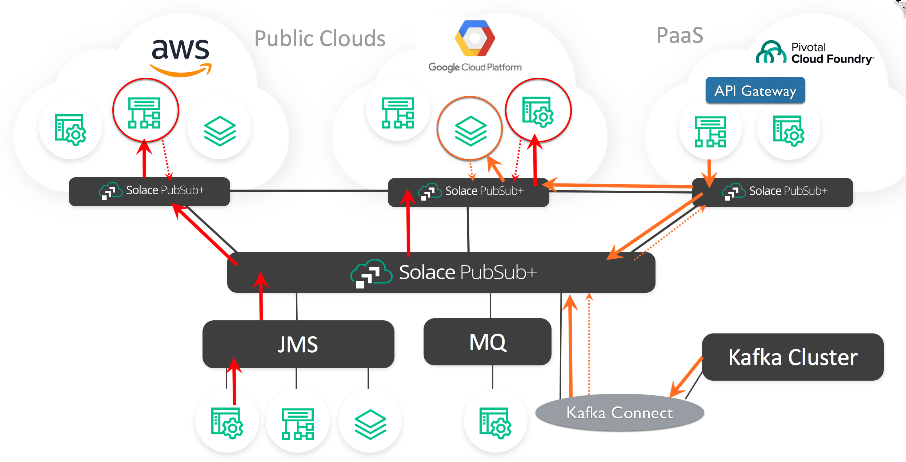

# Solace Sink Kafka Connector v1.0
## Synopsis

This project provides a Solace/Kafka Sink Connector (adapter) that makes use of the Kafka Connect libraries. The Solace/Kafka adapter consumes Kafka topic records and streams the data events to the Solace Event Mesh as a Topic and/or Queue data event. 

On the Solace side of the Sink Connector the adapter is using Solace's high performance Java API to stream Solace messages to a Solace Broker (PubSub+ appliance, software or Solace Cloud service). Unlike many other message brokers, Solace supports transparent protocol and API messaging transformations. Therefore, any message that reaches the Solace broker is not limited to being consumed from the Solace broker only by Java clients using the same JCSMP libraries
that were used to send the messages to the Solace Broker. Solace supports transparent interoperability with many 
message transports and languages/APIs. Therefore, from the single Solace Sink Connector any Kafka Topic (Key or not Keyed) Sink Record consumed by 
the Solace Sink Connector is suddenly available for consumption by any consumer that uses one of the Solace supported languages or transport protocols.

Consider the following diagram:


It does not matter that the Kakfa record was consumed by the Connector and sent using Java JCSMP transport to a Solace broker (appliance, software or cloud). The Solace even message can transparently be consumed by a Cell Phone, a REST Server or an AMQP, JMS, MQTT message, etc. as a real-time asynchronous data event.

The Solace Sink Connector also ties Kafka records into the Solace Event Mesh. The Event Mesh is a clustered group of Solace PubSub+ Brokers that transparently, in real-time, route data events to any Service that is part of the Event Mesh. Solace PubSub+ Brokers (Appliances, Software and SolaceCloud) are connected to each other as a multi-connected mesh that to individual services (consumers or producers of data events) appears to be a single Event Broker. Events messages are seamlessly transported within the entire Solace Event Mesh regardless of where the event is created and where the process exists that has registered interested in consuming the event. Simply by registering interest in receiving events, the entire Event Mesh becomes aware of the registration request and will know how to securely route the appropriate events generated by the Solace Sink Connector.

The Solace Sink Connector allows the creation and storage of a new Kafka record to become an event in the Solace Event Mesh. The Solace Sink Connector provides the ability to transparently push any new Kafka Record that is placed onto a Kafka Topic into the Solace Event Mesh. That new event can be consumed by any other service that is connected to the Solace Event Mesh and has registered interest in the event. As a result, all other service that are part of the Event Mesh will be able to receive the Kafka Records through this single Solace Sink Connector. There is no longer a requirement for separate Kakfa Sink Connectors to each of the separate services. The single Solace Sink Connector is all that is required. Once the Record is in the Event Mesh, it is available to all other services. 

The Solace Sink Connector eliminates the complexity and overhead of maintaining separate Sink Connectors for each and every service that may be interested in the same data that is placed into a Kafka Topic. There is the added benefit of access to services where there is no Kafka Sink Connector available, thereby eliminating the need to create and maintain a new connector for new services that may be interested in Kafka Records.

Consider the following:


A single Solace Sink Connector will be able to move the new Kakfa Record to any downstream service via a single connector. 

The Solace Sink Connector also ties into Solace's location transparency for the Event Mesh PubSub+ brokers. Solace supports a wide range of brokers for deployment. There are three major categories of Solace PubSub+ brokers: dedicated extreme performance hardware appliances, high performance software brokers that are deployed as software images (deployable under most Hypervisors, Cloud IaaS and PaaS layers and in Docker) and provided as a fully managed Cloud MaaS (Messaging as a Service). 

It does not matter what Solace Broker is used or where it is deployed, it can become part of the Solace Event Mesh. Therefore, there are no restrictions on where the Solace Sink Connector is deployed or what PubSub+ broker is used to connect Kafka to the Solace Event Bus. The Solace Event Mesh infrastructure will allow, via the Solace Sink Connector, Kafka events to be consumed by any Service anywhere that is part of the Event Mesh. 

Consider the following:



It does not matter if the Kakfa record storage event was generated by a Solace Sink Connector in the Cloud or on premise. It does not matter if Solace Sink Connector was connected to a Solace PubSub+ broker that was an appliance, on premise or Cloud software, or the the Cloud managed MaaS, it will immediately in real time be available to all Solace Event Mesh connected services that are located anywhere. 

It is important to mention that there is also a Solace Source Connector for Kafka available. The Solace Source Connector allows registration of interest in specific events on the Solace Event Mesh. When these events of interest are consumed by the Solace Source Connector, they are placed as a Kakfa Record onto a Kafka Topic.  These events that are stored in Kafka are now transparently available to any application that is consuming Kafka records directly from the Kafka brokers.  Please refer to the Solace Source Connector GitHub repository for more details.  

## Usage

This is a Gradle project that references all the required dependencies. To check the code style and find bugs you can use:

```
./gradlew clean check
```

To actually create the  Connector Jar file use:

```
./gradlew clean jar
```

## Deployment

The Solace Sink Connector has been tested in three environments: Apache Kafka, Confluent Kafka and the AWS Confluent Platform. For testing, it is recommended to use the single node deployment of Apache or Confluent Kafka software.

To deploy the Connector, as described in the Kafka documentation, it is necessary to move the Connector jar file and the required third party jar files to a directory that is part of the Worker-defined classpath. Details for installing the Solace Sink Connector are described in the next two sub sections. 

#### Apache Kafka

For Apache Kafka, the software is typically found, for example for the 2.11 version, under the root directory: "/opt/kafka-apache/"kafka_2.11-1.1.0". Typically the Solace Sink Connector would be placed under the "libs" directory under the root directory. All required Solace JCSMP JAR files should be placed under the same "libs" directory. The properties file for the connector would typically be placed under the "config" directory below the root directory. 

To start the connector in stand-alone mode while in the "bin" directory the command would be similar to:

```
./connect-standalone.sh ../config/connect-standalone.properties ../config/solaceSink.properties
```

In this case "solaceSink.properties" is the configuration file that you created to define the connectors behavior. Please refer to the sample included in this project. 

When the connector starts in stand-alone mode, all output goes to the console. If there are errors they should be visible on the console. If you do not want the output to console, simply add the "-daemon" option and all output will be directed to the logs directory.

#### Confluent Kafka

The Confluent Kakfa software is typically placed under the root directory: "/opt/confluent/confluent-4.1.1". In this case it is for the 4.1.1 version of Confluent. By default, the Confluent software is started in distributed mode with the REST Gateway started. 

THe Solace Sink Connector would typically be placed in the "/opt/confluent/confluent-4.1.1/share/java/kafka-connect-solace". You will need to create the "kafka-connect-solace" directory. You must place all the required Solace JCSMP JAR files under this same directory. If you plan to run the Sink Connector in stand-alone mode, it is suggested to place the properties file under the same directory.

After the Solace files are installed and if you are familiar with Kakfa administration, it is recommended to restart the Confluent Connect software if Confluent is running in Distributed mode. Alternatively, it is simpler to just start and restart the Confluent software with the "confluent" command.

At this point you can test to confirm the Solace Sink Connector is available for use  in distributed mode with the command:

```
curl http://18.218.82.209:8083/connector-plugins | jq
```

In this case the IP address is one of the nodes running the Distributed mode Worker process. If the Connector is loaded correctly, you should see something similar to:


At this point, it is now possible to start the connector in distributed mode with a command similar to:

```
curl -X POST -H "Content-Type: application/json" -d @solace_sink_properties.json http://18.218.82.209:8083/connectors
```

Again, the IP address is one of the nodes running the Distributed mode Worker process. The connector's JSON configuration file, in this case, is called "solace_sink_properties.json".

You can determine if the Sink Connector is running with the following command:

```ini
curl 18.218.82.209:8083/connectors/solaceSinkConnector/status | jq
```

If there was an error in starting, the details will be returned with this command. If the Sink Connector was successfully started the status of the connector and task processes will be "running":


## Configuration

The Solace Sink Connector configuration is managed by the configuration file. For stand-alone Kafka deployments a properties file is used. A sample is enclosed with the project.

For distributed Kafka deployments the connector can be deployed via REST as a JSON configuration file. A sample is enclosed with the project. 

#### Solace Configuration for the Sink Connector

The Solace configuration of the connector's Solace Session, Transport and Security properties are all available and defined in the **SolaceSinkConstants.java** file. These are the equivalent to the details for the Solace **JCSMPSessionProperties** class. Details and documentation for this JCSMPProperies class can be found here:

[Solace Java API](https://docs.solace.com/API-Developer-Online-Ref-Documentation/java/index.html)

For tuning, performance and scaling (multiple tasks is supported with this connector) of the Solace Sink Connector, please refer to the Solace PubSub+ documentation that can be found here:

[Solace PubSub+ Documentation](https://docs.solace.com/)

There is a bare minimum requirement to configure access to the Solace PubSub+ broker. A username, their password and VPN (Solace Virtual Private Network - a "virtual broker" used in Solace multi-tenancy configurations) and host reference are mandatory configuration details. An example of the required configuration file entries is as follows:

```ini
sol.username=heinz1
sol.password=heinz1
sol.vpn_name=heinzvpn
sol.host=160.101.136.33
```

If you have just installed a Solace PubSub+ broker and you are not that familiar with Solace administration, you can test your Sink Connector by using "default" as value for the username, password and VPN name. The host should match the IP address of the broker.

For connectivity to Kafka, the Sink Connector has four basic configuration requirements: name for the Connector Plugin, the name of the Java Class
for the connector, the number of Tasks the connector should deploy and the name of the Kakfa Topic. The following is an example for the Solace Source Connector:

```ini
name=solaceSinkConnector
connector.class=com.solace.sink.connector.SolaceSinkConnector
tasks.max=1
topics=solacetest
```

A more details example is included with this project. This project also includes a JSON configuration file.

#### Solace Record Processor

The processing of the Kafka Source Record to create a Solace message is handled by an interface definition defined in   **SolaceRecordProcessor.java** - This is a simple interface that is used to create the Solace event message from the Kafka record. There are three examples included of classes that implement this interface:

* **SolSimpleRecordProcessor.java** - Takes the Kafka Sink record as a binary payload with a Binary Schema for the value ( which becomes the Solace message payload) and a Binary Schema for the record key and creates and sends the appropriate Solace event message. The Kafka Sink Record key and value scheme can be changed via the configuration file.  
* **SolSimpleKeyedRecordProcessor** - A more complex sample that allows the flexibility of changing the Source Record Key Schema and which value from the Solace message to use as a key. The option of no key in the record is also possible. The Kafka Key is also used as a Correlation ID in the Solace messages and the original Kafka Topic is included for reference in the Solace Message as UserData in the Solace message header.
* **SolSimpleKeyedRecordProcessorDTO** - This is the same as the "SolSimpleKeyedRecordProcessor", but it adds a DTO (Deliver-to-One) flag to the Solace Event message. The DTO flag is part of topic consumer scaling. For more details refer to the Solace documentation. The Solace Source Connector also support consuming Solace Event Messages with the DTO flag. More details are available in in GitHub where you will find the Solace Source Task code and details.


The desired message processor is loaded at runtime based on the configuration of the JSON or properties configuration file, for example:

```ini
sol.record_processor_class=com.solace.sink.connector.recordprocessor.SolSimpleKeyedRecordProcessor
```

It is possible to create more custom Record Processors based on your Kafka record requirements for keying and/or value serialization and the desired format of the Solace event message. Simply add the new record processor classes to the project. The desired record processor is installed at run time based on the configuration file. 

More information on Kakfa Connect can be found here:

[Apache Kafka Connect](https://kafka.apache.org/documentation/)

[Confluent Kafka Connect](https://docs.confluent.io/current/connect/index.html)

#### Scaling the Sink Connector

The Solace Sink Connector will scale when more performance is required. There is only so much throughput that can be pushed through the Connect API. The Solace broker supports far greater throughput than can be afforted through a single instance of the Connect API. The Kafka Broker can also produce records at a rate far greater than available through a single instance of the Connector. Therefore, multiple instances of the Sink Connector will increase throughput from the Kafka broker to the Solace PubSub+ broker.

Multiple Connector tasks are automatically deployed and spread across all available Connect Workers simply by indicating the number of desired tasks in the connector configuration file. 

When the Sink Connector is consuming from Kafka and the event records are expected to be placed in to a Solace Queue, there are no special requirements for the Solace Queue definition. As more instance of the connector are defined in the configuration, they will each simultaneously push event messages into the defined queue. 

The Solace Sink Connector can also be configured to generate Solace Topic event messages when new records are placed into Kafka. There is no special setup on the Solace Broker that the multiple scaled connector instances  to scale the performance of Solace topic-based event messages. 

When a Solace Sink Connector is scaled, it will automatically use a Kakfa Consumer Group to allow Kafka to move the records for the multiple Topic Partitions in parallel.   

#### Sending Solace Event Messages

The Kafka Connect API automatically keeps track of the offset that the Sink Connector has read and processed. If the Sink Connector stops or is restarted, the Connect API will start passing records to the Sink Connector based on the last saved offset. Generally, the offset is saved on a timed basis every 10 seconds. This is tunable in the Connect Worker configuration file.

When the Solace Sink Connector is sending Solace Topic message data events, the chances of duplication and message loss will mimic the underlying reliability and QoS configured for the Kakfa Topic and is also controlled by the timer for flushing the offset value to disk. 

It is also possible to send Kafka Topic messages to Solace queues. A Solace Queue guarantees order of deliver, provides High Availability and Disaster Recovery (depending on the setup of the PubSub+ brokers) and provides an acknowledgment to the message producer (in this case the Solace Sink Connector) when the event is stored in all HA and DR members and flushed to disk. This is a higher guarantee than is provided by Kakfa even for Kafka idempotent delivery.

When the Solace Sink Connector is sending data events to Queues, the messages are send using a Session Transaction. When 200 events are processed, the Solace Connector automatically forces a flush of the offset and then commits the Solace transactions. If the timer goes off before the 200 messages are send the same flush/commit is executed. Therefore, there should be no duplicates sent to the Service Mesh. However, data loss is a factor of the Kafka Topic's reliability and QoS configuration. 

If there is any error or failure and the Offset location is not synced, the Solace transaction will roll back messages in the queue up until the last offset flush. After the connector is restarted, processing will begin again from the last stored Offset.

It is recommended to use Solace Topics when sending events if high throughput is required and the Kakfa Topic is configured for high performance. When a Kakfa topic is configured for it's highest throughput it will potentially result in loss or duplication within the processing of records in the Kafka Topic. 

Increasing the reliability of the Kafka Topic processing to reduce the potential loss or duplication, but will also greatly reduce throughput. When Kafka reliability is critical, it may be recommended to mimic this reliability with the Solace Sink Connector and configure the connector to send the Kafka records to the Event Mesh using Solace Queues. 

## License

This project is licensed under the Apache License, Version 2.0. - See the [LICENSE](https://github.com/SolaceLabs/solace-messaging-demo/blob/master/LICENSE) file for details.